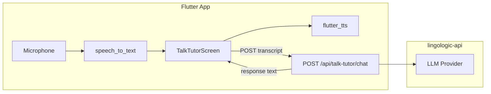

# Talk Tutor MVP Plan

## Scope (PRD vs MVP)

The [talktutorPRD.md](c:/Users/cnieves/Desktop/Projects/lingologic/prd/talktutorPRD.md) describes an enterprise system (WebRTC, GPU ASR, streaming). The MVP simplifies to:

- **Client-side STT**: `speech_to_text` (already in app, used in [PronunciationExerciseWidget](c:/Users/cnieves/Desktop/Projects/lingologic/lib/screens/lessons/widgets/pronunciation_exercise_widget.dart))
- **Client-side TTS**: `flutter_tts` (already in app)
- **LLM**: New API route in lingologic-api (provider-agnostic - OpenAI, Anthropic, or other)
- **Flow**: User speaks → STT → HTTP POST to API → LLM response → TTS playback

---

## 1. Backend: lingologic-api

**Add API route** `app/api/talk-tutor/chat/route.ts` (or `route.js`).

- **Input**: `{ transcript: string, language: string, level?: string, conversationHistory?: Array<{role, content}> }`
- **Output**: `{ text: string }` (AI tutor response)
- **Auth**: Require authenticated session (same as other API routes)
- **LLM**: Use environment variable `TALK_TUTOR_LLM_PROVIDER` (openai, anthropic, etc.) and corresponding key (`OPENAI_API_KEY`, `ANTHROPIC_API_KEY`). Design service layer so switching providers is a config change.

**System prompt** (injected per request): Act as a language tutor for `{language}` at level `{level}`. Keep responses concise (1-2 sentences for MVP), correct gently, encourage practice.

---

## 2. Flutter App

### 2.1 Talk Tutor Service

Create `lib/services/talk_tutor_service.dart`:

- `Future<String?> sendMessage(String transcript, String language, {String? level, List<Message>? history})`
- Calls `BetterAuthConfig.baseUrl/api/talk-tutor/chat` with auth token
- Returns response text or null on error
- Use `AuthService` for session/token (see [better_auth_config](c:/Users/cnieves/Desktop/Projects/lingologic/lib/config/better_auth_config.dart))

### 2.2 Talk Tutor Screen

Create `lib/screens/talk_tutor/talk_tutor_screen.dart`:

- UI: Mic button, transcript display, AI response display, TTS play button
- Reuse permission flow from [PronunciationExerciseWidget](c:/Users/cnieves/Desktop/Projects/lingologic/lib/screens/lessons/widgets/pronunciation_exercise_widget.dart) (microphone)
- Flow: Tap mic → listen with `speech_to_text` → on result, send to `TalkTutorService` → show response → speak with `flutter_tts`
- Optional: Keep last N messages in memory for conversation context (MVP: 3-5 turns)
- Match theme: [app_theme.dart](c:/Users/cnieves/Desktop/Projects/lingologic/lib/theme/app_theme.dart), gradient, card styles

### 2.3 Router and Entry Point

- Add route `/talktutor` in [app_router.dart](c:/Users/cnieves/Desktop/Projects/lingologic/lib/router/app_router.dart)
- Add CTA card on Home tab ([home_tab.dart](c:/Users/cnieves/Desktop/Projects/lingologic/lib/screens/home/home_tab.dart)): "Practice Speaking" / "Talk to Tutor" with mic icon, navigates to `/talktutor`
- Card visibility gated by feature flag `talk_tutor` (see Feature Flag below)

### 2.4 Feature Flag

- Migration: `INSERT INTO feature_flags (key, name, description, enabled) VALUES ('talk_tutor', 'Talk Tutor', 'AI conversational speaking practice', true)`
- In [home_tab.dart](c:/Users/cnieves/Desktop/Projects/lingologic/lib/screens/home/home_tab.dart): Use `FeatureFlagService.isFeatureEnabled('talk_tutor')` before showing the card
- LingoAdmin: Add Talk Tutor to feature flag management UI (if LingoAdmin has that screen; otherwise document for manual toggle)

### 2.5 Localization

- Add keys to `lib/l10n/app_en.arb` and `app_es.arb` (and regenerate): `talkTutor`, `practiceSpeaking`, `tapToSpeak`, `tutorResponse`, `speakingPractice`, etc.
- Wrap all user-facing strings in `AppLocalizations.of(context)!.key`

---

## 3. Data and Auth

- **Auth**: lingologic-api route must validate session (e.g., via Better Auth or existing auth middleware)
- **MVP**: No persistence of conversation history to Supabase. Optional later: `talk_tutor_sessions` table for analytics.

---

## 4. File Summary

| Location                                                           | Action                                    |
| ------------------------------------------------------------------ | ----------------------------------------- |
| lingologic-api/app/api/talk-tutor/chat/route.ts                    | Create (or .js)                           |
| lingologic-api/lib/services/llm-service.ts                         | Create (provider-agnostic)                |
| lingologic/lib/services/talk_tutor_service.dart                    | Create                                    |
| lingologic/lib/screens/talk_tutor/talk_tutor_screen.dart           | Create                                    |
| lingologic/lib/router/app_router.dart                              | Add `/talktutor` route                    |
| lingologic/lib/screens/home/home_tab.dart                          | Add Talk Tutor CTA card (feature-flagged) |
| lingologic/supabase/migrations/XXX_add_talk_tutor_feature_flag.sql | Create                                    |
| lingologic/lib/l10n/app_en.arb, app_es.arb                         | Add translation keys                      |

---

## 5. Environment and Config

- **lingologic-api**: Add `TALK_TUTOR_LLM_PROVIDER`, `OPENAI_API_KEY` (or `ANTHROPIC_API_KEY`) to `.env`
- **lingologic**: No new env vars; uses existing `BetterAuthConfig.baseUrl` for API

---

## 6. Out of Scope for MVP

- Pronunciation scoring
- Streaming audio
- WebRTC
- Session persistence / analytics
- Curriculum constraints
- Learning personalization service

